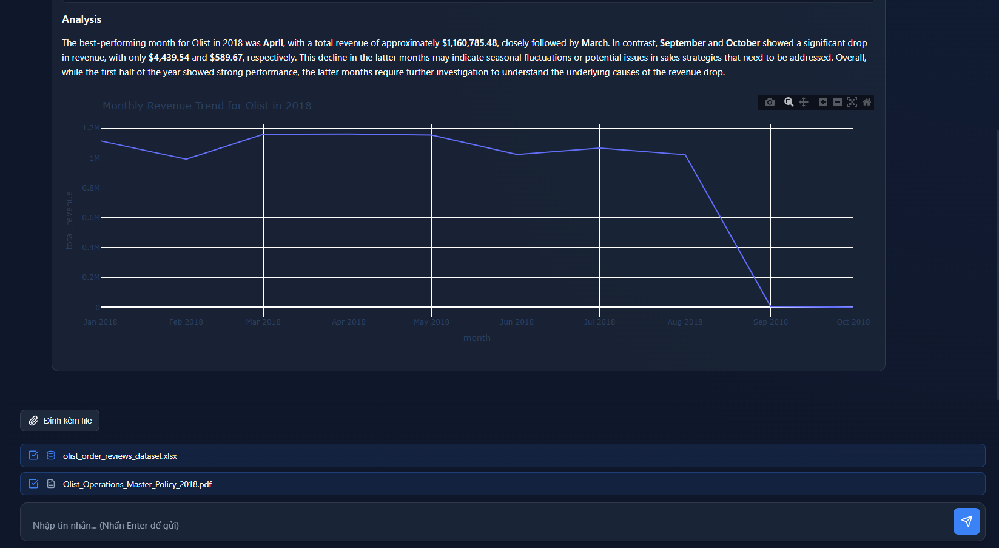
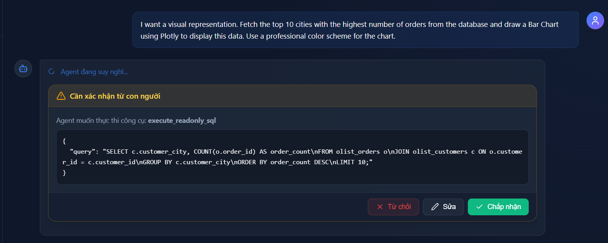
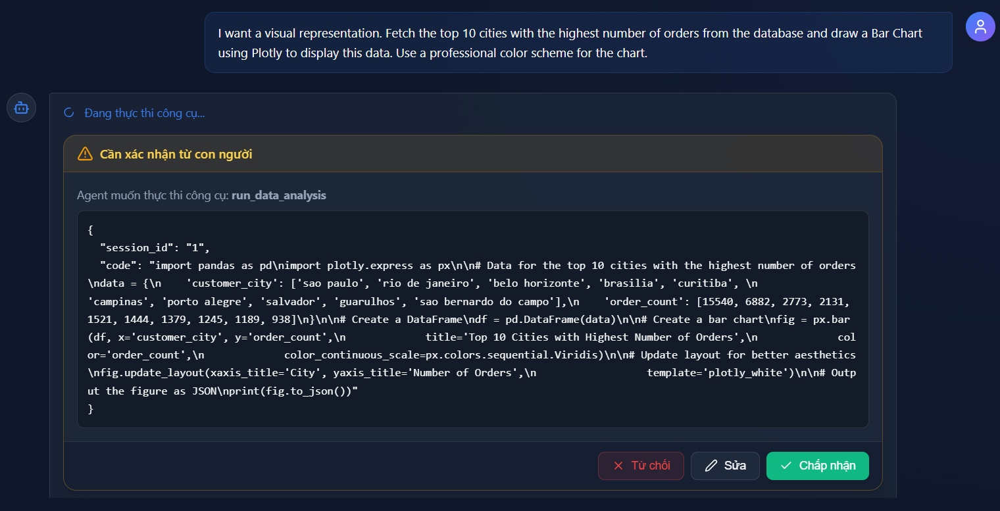
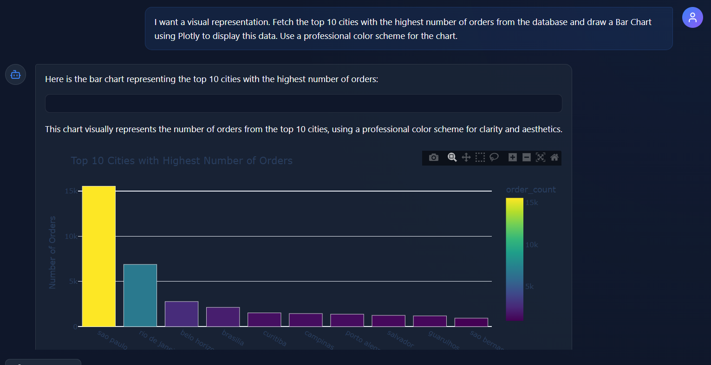

# AI-Powered E-Commerce Data Assistant (MADS)


Một hệ thống AI Assistant Full-stack được thiết kế theo kiến trúc **Stateful Agentic Workflow** với nền tảng là ReAct pattern. Ứng dụng tích hợp các công nghệ tiên tiến về LLM và Data Engineering nhằm phân tích, truy vấn và trực quan hóa tập dữ liệu thương mại điện tử phức tạp, đồng thời đảm bảo tính bảo mật và kiểm soát chặt chẽ thông qua cơ chế Human-in-the-Loop.

## Điểm nổi bật (Key Features)

* **Stateful Agentic Workflow (LangGraph):** Đóng vai trò là Orchestrator điều phối các công việc phức tạp, tự động lên kế hoạch, gọi tool và tổng hợp kết quả.
* **Long-term Memory (Checkpointer):** Sử dụng LangGraph Checkpointer để lưu trữ toàn bộ context và trạng thái của các phiên trò chuyện, giúp Agent có khả năng "nhớ" ngữ cảnh dài hạn và cá nhân hóa trải nghiệm.
* **Secure Data Access (Read-only Query Tool):** Công cụ truy vấn Database (SQL Tool) được cấp quyền bằng một user `readonly` chuyên biệt trên PostgreSQL, ngăn chặn hoàn toàn rủi ro AI thực thi các lệnh xóa/sửa dữ liệu nguy hiểm.
* **Isolated Code Sandbox:** Môi trường thực thi code Python (để sinh biểu đồ, phân tích data) được cô lập hoàn toàn (Secure Sandbox), tránh rủi ro bảo mật cho hệ thống máy chủ chính.
* **MCP Server Integration:** Sử dụng **Model Context Protocol (MCP)** để chuẩn hóa việc phục vụ và giao tiếp các Tools cho LLM, giúp hệ thống dễ dàng mở rộng và tách biệt logic của tools khỏi core agent.
* **RAG Pipeline:** Xử lý tài liệu và văn bản phức tạp với **Docling**, kết hợp cùng Vector Database để truy xuất thông tin ngữ cảnh chính xác cao.
* **Asynchronous Processing:** Sử dụng **Celery + Redis** để xử lý các tác vụ nặng (Data Ingestion, nhúng vector) dưới background mà không chặn luồng chính của API.
* **Human-in-the-Loop (HITL):** Tích hợp cơ chế phê duyệt của con người trước khi Agent thực thi các tác vụ nhạy cảm hoặc tiêu tốn tài nguyên lớn.

## Tech Stack

* **Backend:** FastAPI, Python, Celery, Redis
* **AI / Orchestration:** LangChain, LangGraph, Model Context Protocol (MCP)
* **Data / RAG:** PostgreSQL, Qdrant (Vector DB), MinIO (Object Storage), Docling (Parsing)
* **Infrastructure:** Docker, Docker Compose, Nginx, Let's Encrypt (Certbot)
* **Frontend:** ReactJS / Vite (Này mình vibe code =>)

## Dataset: Olist E-Commerce
Hệ thống được thiết kế để phân tích tập dữ liệu **Olist** (Brazilian E-Commerce Public Dataset). Đây là một tập dữ liệu thực tế lớn bao gồm thông tin về:
* Hơn 100,000 đơn hàng từ năm 2016 đến 2018.
* Chi tiết sản phẩm, khách hàng, đánh giá (reviews), vị trí địa lý và các luồng thanh toán.
* **Thử thách giải quyết:** Agent phải hiểu được Schema cơ sở dữ liệu quan hệ phức tạp này để tự động viết SQL, tổng hợp báo cáo và trả lời các câu hỏi kinh doanh của người dùng.

---

## Demo & Screenshots

### 1. Giao diện Chat & Trực quan hóa dữ liệu
![Giao diện chính]
<p align="center">
  
</p>
*Người dùng yêu cầu báo cáo doanh thu, Agent tự động viết SQL, lấy data và viết code sinh biểu đồ ngay trên giao diện.*

### 2. Luồng Human-in-the-Loop (HITL)
![HITL Demo1]
<p align="center">
  
</p>
---
<p align="center">
  
</p>
---
<p align="center">
  
</p>

*Hệ thống tạm dừng và yêu cầu người dùng xác nhận trước khi cho phép Agent thực thi một đoạn mã phân tích phức tạp.*

## Hướng dẫn triển khai (Deployment)

Dự án được đóng gói hoàn toàn bằng Docker, giúp việc triển khai lên môi trường Production (hoặc chạy Local).

### Bước 1: Clone Repository
```bash
git clone https://github.com/HieuITMHG/project-mads.git
cd project-mads
```

### Bước 2: 

Bạn sẽ cần một tài khoản kaggle để tải và ingest Olist dataset về. Mở file .env.prod và sửa

* KAGGLE_USERNAME=your_kaggle_username
* KAGGLE_KEY=your_kaggle_key

Mình sử dụng API của OpenAI cho phần LLM

* OPENAI_API_KEY=your_api_key

Mở file frontend/.env.production sửa 

* VITE_API_URL=https://<your-domain>/api

### Bước 3:

Chạy lệnh sau để build image cho Sandbox

```bash
docker build -t mads-sandbox-base -f infras/docker/Dockerfile.sandbox .
```

### Bước 4:
Build project

```bash
make build ENV=prod
```

### Bước 5:
```bash
make up ENV=prod
```

Bạn đã có thể truy cập domain của mình.

---

## Cấu trúc Branch (Branch Structure)

Dự án hiện tại đang được rẽ nhánh thành 2 kiến trúc Agent khác nhau để thử nghiệm:

1. **Nhánh `master` (Human-in-the-Loop - Single Agent):** 
   - Sử dụng một Agent duy nhất ôm đồm tất cả các Tools.
   - **Ưu điểm:** Hỗ trợ tính năng Human-in-the-Loop (HITL) hoàn hảo. Hệ thống có thể dừng lại `interrupt_before=["tools"]` để chờ người dùng duyệt lệnh SQL hoặc Python trước khi thực thi.
   - **Nhược điểm:** LLM dễ bị quá tải khi phải quản lý quá nhiều công cụ cùng lúc, dẫn đến suy luận sai hoặc chọn nhầm công cụ.

2. **Nhánh `dev-multi_agent_v2` (Multi-Agent Supervisor - No HITL):**
   - Thiết kế theo mô hình phân cấp: Có một `Supervisor Agent` đóng vai trò quản lý, phân phát nhiệm vụ (Delegate) cho các chuyên gia như `SQL_Agent` và `Analyst_Agent`.
   - **Ưu điểm:** Khả năng suy luận vượt trội. Từng Sub-agent chỉ tập trung vào một nhiệm vụ duy nhất (viết SQL hoặc viết Python), giảm thiểu tối đa hiện tượng ảo giác (hallucination) của LLM. Có cơ chế tự động fix lỗi và retry cục bộ.
   - **Nhược điểm & Khó khăn về mặt Kiến trúc:** Hiện tại nhánh này **chưa có cơ chế Human-in-the-Loop**. 
     - *Nguyên nhân:* Trong LangGraph, cơ chế `interrupt_before` chỉ bắt được Node ở ngay cấp độ (level) của Graph hiện tại. Với kiến trúc Multi-Agent Supervisor, các Tools thực sự được bọc kín (encapsulated) sâu bên trong các Sub-graphs (như `sql_graph`, `analyst_graph`). 
     - Lớp Main Graph (chứa Supervisor) hoàn toàn không nhìn thấy các Tool Node này để mà đặt cờ `interrupt`.
     - Để ép buộc HITL hoạt động, ta sẽ phải ném State của toàn bộ các Sub-graph ra bên ngoài để Main Graph quản lý, điều này phá vỡ hoàn toàn tính đóng gói (encapsulation) của hướng đối tượng và làm logic lưu trữ State (trên REST API) trở nên cực kỳ rườm rà.

---

## Các Câu hỏi Mẫu để Kiểm thử (Sample Prompts)

Dưới đây là một số câu hỏi mẫu từ các cấp độ khác nhau để bạn có thể sao chép và kiểm thử sức mạnh của hệ thống:

**1. Truy vấn Dữ liệu Cơ bản (Database Extraction):**
> "Please calculate the total revenue of the Olist system and the total number of successfully delivered orders (status 'delivered'). Format the currency for readability."

**2. Vẽ Biểu đồ Trực quan (Charting Capabilities):**
> "I want a visual representation. Fetch the top 10 cities with the highest number of orders from the database and draw a Bar Chart using Plotly to display this data. Use a professional color scheme for the chart."

**3. Đọc hiểu File đính kèm (Process Uploaded Files):**
> *(Nhớ đính kèm một file Excel/CSV chứa dữ liệu reviews vào chat)*
> "Based on the reviews dataset I just attached to this chat session, draw a distribution chart (Histogram or Bar chart) counting the occurrences of each review score (review_score from 1 to 5)."

**4. Phân tích Chuyên sâu (Multi-Agent Reasoning Combo):**
> "Act as a Data Analysis Expert. I need a report on Olist's business performance by month for the year 2018.
> 1. Query the database to calculate total revenue for each month.
> 2. Draw a Line Chart showing the revenue trend.
> 3. Based on the chart, write a short analysis (about 3-4 sentences) pointing out the best-performing month, any sluggish months, and provide your overall insights."
